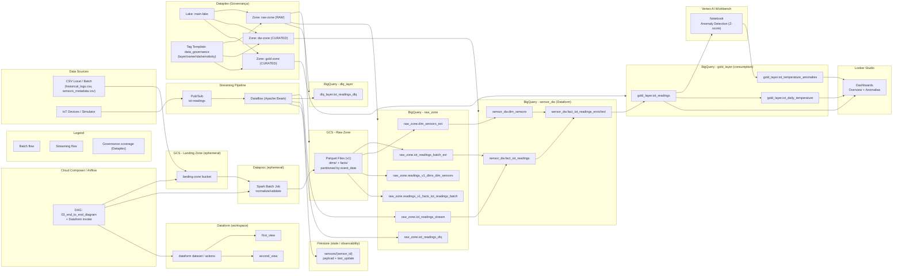
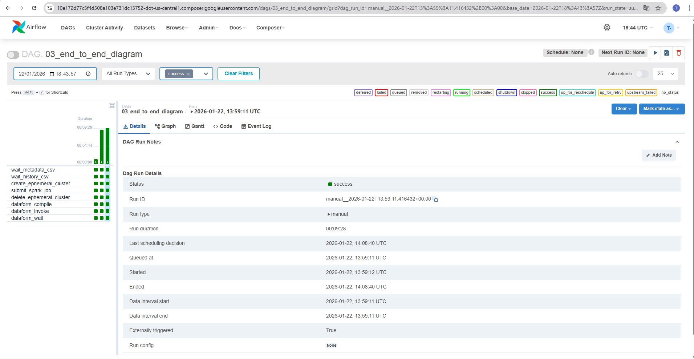
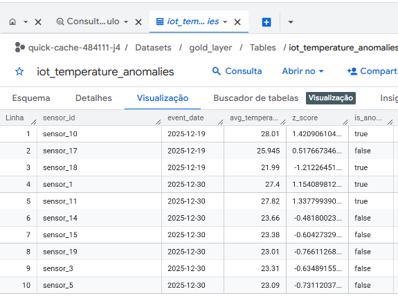
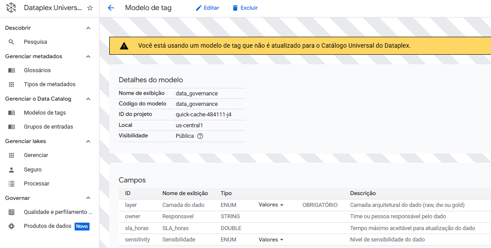
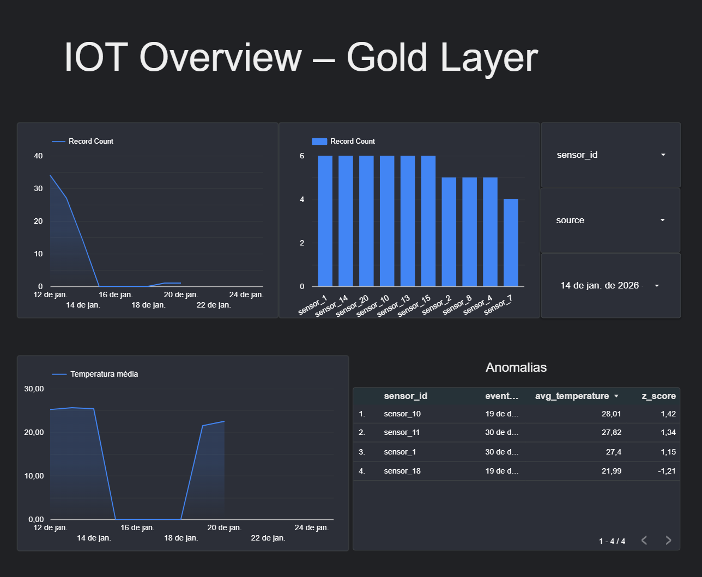

# GCP Data Engineering Lab  
### Pipeline IoT End-to-End (Batch + Streaming + Governança + BI + ML)

## 🎯 Objetivo

Este projeto implementa um **pipeline de dados moderno e escalável**, cobrindo ingestão **batch** e **streaming**, orquestração, transformações analíticas, governança de dados, BI e ML, utilizando diversos **serviços gerenciados da Google Cloud Platform (GCP)**.

O foco está na **qualidade arquitetural**, **boas práticas** e **decisões conscientes**, consolidadas durante a preparação e obtenção da certificação **Google Professional Data Engineer**.

## 🧰 Tech Stack (GCP)

- **Storage & Analytics:** Cloud Storage (GCS), BigQuery  
- **Batch Processing:** Dataproc (Apache Spark)  
- **Streaming:** Pub/Sub, Dataflow (Apache Beam)  
- **Orchestration:** Cloud Composer (Airflow)  
- **Transformations:** Dataform  
- **Governance:** Dataplex (lakes, zones, tags)  
- **Machine Learning:** Vertex AI Workbench  
- **State / Observability (dev):** Firestore  
- **Infrastructure as Code:** Terraform  

---

## 🧱 Architecture Overview

<p align="center">
  
</p>

<details>
<summary>📐 View architecture as Mermaid code</summary>


</details> 


## 📂 Repository Structure

```text
gcp-data-engineering-lab/
│
├─ dags/
│  └─ 03_end_to_end_diagram.py
│
├─ data/
│  └─ local/
│     └─ legacy/
│        ├─ historical_logs.csv
│        └─ sensors_metadata.csv
│
├─ infra/
│  ├─ main.tf
│  ├─ providers.tf
│  ├─ variables.tf
│  ├─ outputs.tf
│  ├─ versions.tf
│  └─ modules/
│     ├─ 01-storage/
│     ├─ 02-compute/
│     └─ 03-governance/
│
├─ pipelines/
│  ├─ batch/
│  │  └─ dataproc/jobs/spark_batch_ingest.py
│  └─ streaming/
│     └─ dataflow/streaming_job.py
│
├─ scripts/
│  └─ check_firestore.py
│
├─ requirements.txt
└─ .gitignore
```
Dados locais, estado do Terraform e artefatos temporários são ignorados por design.

🔁 Data Ingestion
📦 Batch Pipeline
Geração de dados históricos em CSV
Upload para GCS Landing Zone (efêmera)
Processamento via Dataproc (Spark):
normalização
validação
escrita em Parquet particionado
Persistência na RAW Zone

📡 Streaming Pipeline
Simulação de dispositivos IoT
Publicação em Pub/Sub
Processamento via Dataflow (Apache Beam):
escrita em BigQuery (streaming table)
escrita em DLQ (BigQuery)
escrita em Firestore como state store (dev)
Semântica aplicada:
at-least-once no streaming
deduplicação garantida na camada GOLD

🧠 Orchestration (Airflow / Cloud Composer)
A DAG 03_end_to_end_diagram coordena o fluxo end-to-end:
Aguarda arquivos na Landing Zone
Executa Spark em Dataproc efêmero
Remove o cluster após execução (otimização de custo)
Dispara transformações analíticas via Dataform
Características:
DAG idempotente
Infra não persistente
Execuções limpas e controladas
<p align="center">  </p>
<br/>


🗄️ Data Warehouse (BigQuery)
O BigQuery atua como single source of truth, organizado em camadas:
RAW: dados brutos batch + streaming
DW: modelo canônico (fatos e dimensões)
GOLD: dados consolidados para consumo
Transformações declarativas e versionadas via Dataform.
<p align="center">  </p>
<br/>


🏛️ Data Governance (Dataplex)
Lake: main-lake
Zones: RAW, CURATED (DW), CURATED (GOLD)
Assets: GCS e BigQuery
Tag Template: data_governance
layer
owner
sla_horas
sensitivity
Governança visível, auditável e desacoplada do pipeline.
<p align="center">  </p>
<br/>


📊 BI (Looker Studio)
Dashboards consomem diretamente a camada GOLD, sem SQL para o usuário final.
Inclui:
visão geral de temperatura
tendências temporais
anomalias detectadas
<p align="center">  </p>
<br/>


🤖 Machine Learning (Vertex AI)
Uso do Vertex AI Workbench
Extração de dados da camada GOLD
Anomaly Detection baseado em Z-score global
Escrita em gold_layer.iot_temperature_anomalies
Decisão consciente:
foco em explicabilidade
base sólida para evolução futura

🧪 Validations Performed
Contagem consistente entre camadas
Deduplicação correta
Partições coerentes
IAM validado
Batch e streaming coexistindo
DLQ funcional
Governança visível no Dataplex

🏁 Conclusion
Este projeto entrega:
✅ Pipeline real e end-to-end
✅ Batch + Streaming integrados
✅ Governança aplicada corretamente
✅ BI e ML fechando o ciclo
✅ Infraestrutura desacoplada e escalável
✅ Portfólio tecnicamente defendível em entrevista

Arquitetura completa de engenharia de dados, com decisões explícitas e trade-offs conscientes.